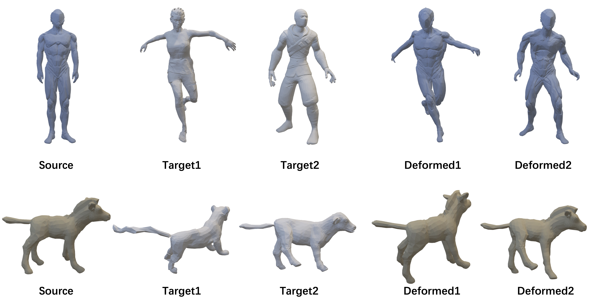

# Weakly-supervised 3D Pose Transfer with Keypoints (ICCV2023)
## [Project Page](https://jinnan-chen.github.io/ws3dpt/) | [Paper](https://arxiv.org/abs/2307.13459)

<p align="center">
  
</p>

The model consists of the followwing steps:\
1.Keypoint detection\
2.Inverse IK\
3.Motion propagation\
4.Mesh refinement

Detailed documentation will be updated.

## Citation
If you find our code or paper helps, please consider citing:
```
@article{jnchen23ws3dpt,
                title={Weakly-supervised 3D Pose Transfer with Keypoints},
                author={Jinnan Chen and Chen Li Gim Hee Lee},
                year={2023}
}
